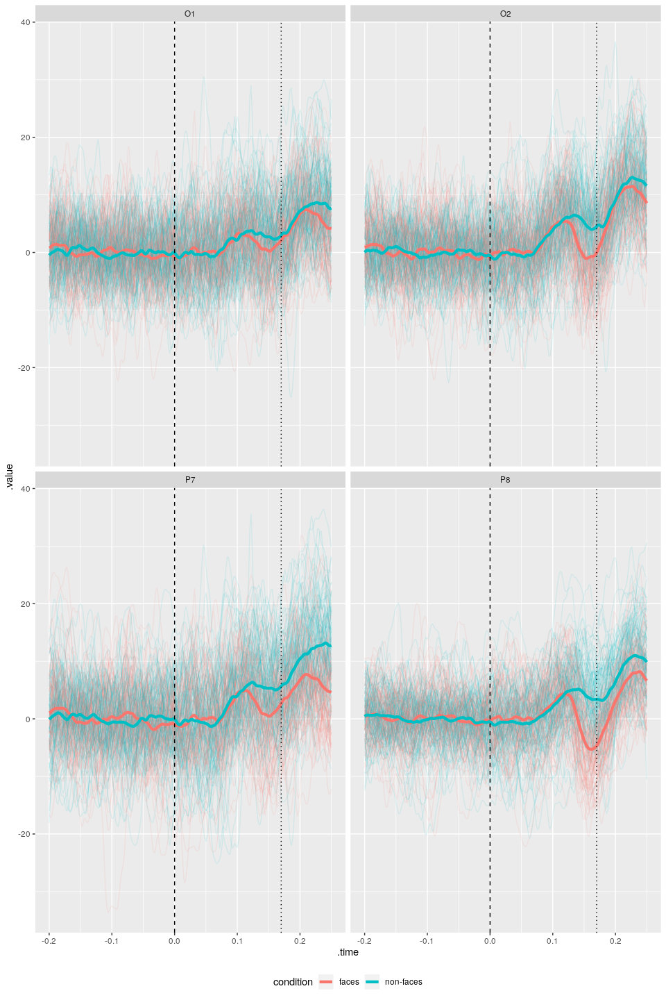
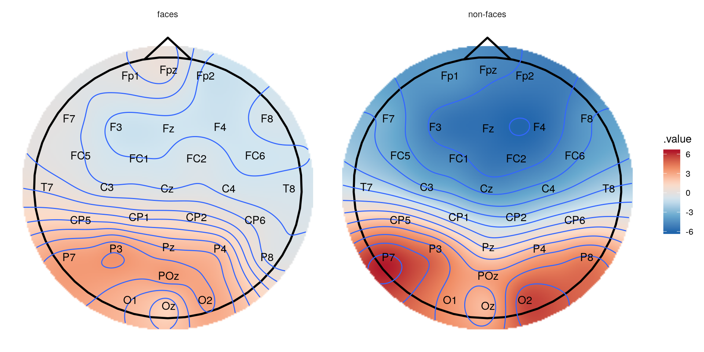

[](https://github.com/bnicenboim/eeguana/actions)
[](https://codecov.io/gh/bnicenboim/eeguana?branch=master)
[](https://zenodo.org/badge/latestdoi/153299577)
[](https://www.tidyverse.org/lifecycle/#experimental)
[](https://www.repostatus.org/#wip)

# eeguana 

## Overview

A package for flexible manipulation of EEG data. `eeguana` provides a
`data.table` powered framework through `tidytable` for manipulating EEG
data with *dplyr*-like functions (e.g., `eeg_mutate`, `eeg_filter`,
`eeg_summarize`) extended to a new class `eeg_lst`, other
EEG-specialized functions, and `ggplot` wrapper functions. The new class
is inspired by tidyverse principles but it’s not really “tidy” (due to
space considerations), it’s a list of (i) a wide *data table*
(`signal_tbl`) that contains the signal amplitudes at every sample point
of the EEG, (ii) an events *data table* with information about markers
(or triggers), blinks and other exported information, and (iii) a long
table with experimental information, such as participant number
(`.recording`), conditions, etc.

*eeguana* can do only basic pre-processing for now, more complete
packages exist for Matlab ([FieldTrip](http://www.fieldtriptoolbox.org/)
and [EEGLAB](https://sccn.ucsd.edu/eeglab/index.php)) and python
([MNE](https://martinos.org/mne/stable/index.html)).

See
[Reference](https://bnicenboim.github.io/eeguana/reference/index.html)
for more information about the functions of *eeguana*.

**NOTE: Changes in dependencies that broke the package are now fixed!**

## Installation

There is still **no** released version of *eeguana*. The package is in
the early stages of development, and it **will** be subject to a lot of
changes. To install the latest version from github use:

``` r
devtools::install_github("bnicenboim/eeguana")
```

## Example

Here, I exemplify the use of *eeguana* with (pre-processed) EEG data
from BrainVision 2.0. The data belong to a simple experiment where a
participant was presented 100 faces and 100 assorted images in random
order. The task of the experiment was to mentally count the number of
faces.

First we download the data:

``` r
# Run the following or just download the files from brain_vision folder in https://osf.io/tbwvz/
library(httr)
GET("https://osf.io/q6b7x//?action=download",
  write_disk("./faces.vhdr", overwrite = TRUE),
  progress()
)
GET("https://osf.io/ft5ge//?action=download",
  write_disk("./faces.vmrk", overwrite = TRUE),
  progress()
)
GET("https://osf.io/85dgj//?action=download",
  write_disk("./faces.dat", overwrite = TRUE),
  progress()
)
```

BrainVision 2.0 exports three files: `faces.vhdr`, `faces.vmrk`, and
`faces.dat`. The file `faces.vhdr` contains the metadata and links to
the other two files, `faces.vmrk` contains the triggers and other events
in the samples, and `faces.dat` contains the signals at every sample for
every channel recorded.

``` r
library(eeguana)
```

We first need to read the data:

``` r
faces <- read_vhdr("faces.vhdr")
#> # Reading file faces.vhdr...
#> # Data from ./faces.dat was read.
#> # Data from 1 segment(s) and 34 channels was loaded.
#> # Object size in memory 140.5 Mb
```

The function `read_vhdr()` creates a list with data frames for the
signal, events, segments information, and incorporates in its attributes
generic EEG information.

``` r
faces
#> # EEG data:
#> 
#> # Signal table:
#> Key: <.id, .sample>
#>           .id      .sample           Fp1           Fpz           Fp2
#>         <int> <sample_int> <channel_dbl> <channel_dbl> <channel_dbl>
#>      1:     1            1     -4.270188    -12.496757     -8.512611
#>      2:     1            2     -5.986778    -11.261559     -8.302858
#>      3:     1            3     -6.580773     -9.333183     -7.679757
#>      4:     1            4     -5.896090     -6.184696     -6.079263
#>      5:     1            5     -5.349657     -2.581047     -3.960115
#>     ---                                                             
#> 525203:     1       525203    -19.180754    -14.482754    -11.880928
#> 525204:     1       525204    -14.669420    -10.800195     -7.822333
#> 525205:     1       525205    -10.086312     -7.376223     -4.007497
#> 525206:     1       525206     -5.963717     -6.318047     -2.550068
#> 525207:     1       525207     -2.811746     -9.569276     -5.257495
#>                    F7            F3            Fz            F4            F8
#>         <channel_dbl> <channel_dbl> <channel_dbl> <channel_dbl> <channel_dbl>
#>      1:     5.8104863     0.7987084    -3.7944875     -7.004565    -9.5905457
#>      2:     4.4670320    -0.4558482    -3.9204431     -7.312232   -10.1968956
#>      3:     3.7081127    -1.8434987    -3.6854007     -7.325179   -10.5801353
#>      4:     3.9488502    -2.6274934    -2.2696950     -6.544898   -10.5005941
#>      5:     4.6228004    -2.9634132    -0.1724038     -5.449733   -10.2940083
#>     ---                                                                      
#> 525203:    -3.0353870    -3.5060143    -5.1268702     -3.885933     1.3387113
#> 525204:    -0.2864416    -2.9062314    -4.6610451     -3.474034     0.5267539
#> 525205:     2.3745189    -2.2934551    -3.9615459     -2.554780    -0.1948199
#> 525206:     4.0785899    -2.8591332    -4.5113835     -2.396278    -0.8776174
#> 525207:     3.9431772    -4.7773180    -7.2133980     -4.015337    -1.6118808
#>                   FC5           FC1           FC2           FC6            M1
#>         <channel_dbl> <channel_dbl> <channel_dbl> <channel_dbl> <channel_dbl>
#>      1:    -5.5008502     -1.040939     -5.750594     -9.455340     3.2116241
#>      2:    -8.2559958     -1.625572     -6.205832     -9.701509     1.5566816
#>      3:    -8.9441166     -2.496611     -6.225702     -9.615817     0.4754019
#>      4:    -5.3551817     -3.275798     -5.792281     -8.781445    -0.3485098
#>      5:    -0.5347631     -3.816769     -5.539208     -7.758235    -1.6416440
#>     ---                                                                      
#> 525203:    -6.0354300     -3.429955     -1.821500     -1.574225    -3.9028225
#> 525204:    -5.6796050     -3.269526     -1.967095     -2.711437    -1.4479842
#> 525205:    -5.2791243     -2.709156     -1.333362     -3.477794     0.6584158
#> 525206:    -5.5155010     -2.732390     -1.006990     -4.265026     2.0143995
#> 525207:    -7.1379128     -3.719297     -1.199275     -6.290535     3.4945364
#>                    T7            C3            Cz            C4            T8
#>         <channel_dbl> <channel_dbl> <channel_dbl> <channel_dbl> <channel_dbl>
#>      1:    -2.5749669     -3.198639     -7.162738    -6.0244598     -4.771918
#>      2:    -2.1688442     -3.223826     -7.327467    -4.7359419     -3.939853
#>      3:    -1.5235398     -4.196370     -7.618096    -3.2705278     -3.285263
#>      4:    -0.1197605     -6.155464     -7.683692    -1.2953618     -2.399213
#>      5:     1.5852079     -8.072474     -7.589663     0.9121451     -1.056782
#>     ---                                                                      
#> 525203:    -9.0984344     -2.281207     -1.244156    -2.6202018     -3.093663
#> 525204:    -8.1386690     -1.984105     -1.888554    -3.1423230     -2.935883
#> 525205:    -7.0688133     -1.378137     -2.078016    -2.8522072     -3.875237
#> 525206:    -6.4578338     -1.488095     -2.738976    -3.3436871     -4.052106
#> 525207:    -7.3460751     -2.911523     -4.274473    -5.8495107     -4.504183
#>                    M2           CP5           CP1           CP2           CP6
#>         <channel_dbl> <channel_dbl> <channel_dbl> <channel_dbl> <channel_dbl>
#>      1:    -3.2116241     -6.062939     -4.813977    -5.0018249    -8.6002913
#>      2:    -1.5566816     -5.505422     -4.283286    -3.9824409    -6.4684544
#>      3:    -0.4754019     -5.300730     -4.089828    -2.8778281    -4.4623995
#>      4:     0.3485098     -5.378413     -4.206456    -1.4029371    -2.4144411
#>      5:     1.6416440     -5.488734     -4.434868     0.3268354    -0.1063155
#>     ---                                                                      
#> 525203:     3.9028225     -8.155416     -3.549603    -3.7856157    -1.9837997
#> 525204:     1.4479842     -6.898589     -3.393985    -4.0930557    -3.5452051
#> 525205:    -0.6584158     -5.362293     -2.832092    -3.8660426    -4.0679202
#> 525206:    -2.0143995     -4.340692     -2.890889    -4.3359194    -4.9113569
#> 525207:    -3.4945364     -4.906254     -4.134459    -6.3578181    -7.4022784
#>                    P7            P3            Pz            P4            P8
#>         <channel_dbl> <channel_dbl> <channel_dbl> <channel_dbl> <channel_dbl>
#>      1:   -6.72501945     -7.823194     -9.713374    -10.933434    -4.1939182
#>      2:   -4.19162369     -6.248482     -8.652735     -8.811299    -2.4914169
#>      3:   -1.97165060     -4.997821     -7.685406     -6.668526    -1.0310369
#>      4:   -0.09873655     -3.947244     -6.593503     -4.320339     0.6503686
#>      5:    1.68736827     -2.843956     -5.372189     -1.687156     2.8481901
#>     ---                                                                      
#> 525203:  -17.43293571     -7.778884     -3.405085     -1.660518    -4.3979721
#> 525204:  -14.93541336     -6.817270     -4.063128     -2.827326    -5.3324118
#> 525205:  -12.36065578     -5.574656     -4.185033     -3.481713    -6.1155925
#> 525206:  -10.60478783     -5.109689     -4.693735     -4.598518    -7.1271410
#> 525207:  -11.30642700     -6.548401     -6.205623     -6.893994    -9.2952871
#>                   POz            O1            Oz            O2          EOGV
#>         <channel_dbl> <channel_dbl> <channel_dbl> <channel_dbl> <channel_dbl>
#>      1:    -13.021215     -7.650791    -8.6958437     -8.901768    36.3205566
#>      2:    -10.943350     -3.840688    -5.8336391     -6.211349    39.7541809
#>      3:     -8.963390     -0.550869    -3.2353799     -3.810405    42.1534882
#>      4:     -6.857091      2.178792    -0.7047617     -1.321697    44.8317413
#>      5:     -4.618455      4.996092     2.2072635      1.650699    49.1988983
#>     ---                                                                      
#> 525203:     -7.370723    -17.387997   -13.6087084    -10.443031     0.8650103
#> 525204:     -7.889754    -15.422725   -14.4835081    -12.536522    -0.9290609
#> 525205:     -7.927995    -13.746743   -15.2129507    -14.059873    -1.9016356
#> 525206:     -8.352034    -13.172369   -16.1580162    -15.562737    -3.9798355
#> 525207:     -9.975165    -14.335607   -17.8692055    -17.643250    -9.1380615
#>                  EOGH
#>         <channel_dbl>
#>      1:      20.61859
#>      2:      25.55089
#>      3:      29.02995
#>      4:      30.14127
#>      5:      29.85255
#>     ---              
#> 525203:     -12.82597
#> 525204:     -14.95488
#> 525205:     -14.81808
#> 525206:     -12.73059
#> 525207:     -12.55048
#> 
#> # Events table:
#>         .id        .type .description     .initial       .final .channel
#>       <int>       <char>       <char> <sample_int> <sample_int>   <char>
#>    1:     1  New Segment                         1            1     <NA>
#>    2:     1 Bad Interval  Bad Min-Max         2158         2895      Fp1
#>    3:     1 Bad Interval  Bad Min-Max         2161         2891      Fp2
#>    4:     1 Bad Interval  Bad Min-Max         2162         2890      Fpz
#>    5:     1 Bad Interval  Bad Min-Max         2173         2861       F8
#>   ---                                                                   
#> 4272:     1 Bad Interval  Bad Min-Max       524692       524895       P8
#> 4273:     1 Bad Interval  Bad Min-Max       524725       524992      FC5
#> 4274:     1 Bad Interval  Bad Min-Max       524777       525122       P7
#> 4275:     1 Bad Interval  Bad Min-Max       524983       525155       Cz
#> 4276:     1 Bad Interval  Bad Min-Max       525073       525207       O2
#> 
#> # Segments table:
#> Key: <.id>
#>      .id .recording segment
#>    <int>     <char>   <int>
#> 1:     1 faces.vhdr       1
```

Some intervals were marked as “bad” by BrainVision, and so we’ll remove
them from the data. We’ll also segment and baseline the data. In this
experiment, the trigger “s70” was used for faces and “s71” for no faces.
We’ll segment the data using these two triggers.

``` r
faces_segs <- faces |>
  eeg_segment(.description %in% c("s70", "s71"),
    .lim = c(-.2, .25)
  ) |>
  eeg_events_to_NA(.type == "Bad Interval") |>
  eeg_baseline()
#> # Total of 200 segments found.
#> # Object size in memory 12.2 Mb after segmentation.
```

We can also edit the segmentation information and add more descriptive
labels. Once the `eeg_lst` is segmented, the segments table includes the
relevant columns from the events table (but without the leading dots).

*eeguana* has wrappers for many `dplyr` commands for the EEG data. These
commands always return an entire `eeg_lst` object so that they can be
piped using `magrittr`’s pipe, `|>`.

``` r
## To only see the segments table:
segments_tbl(faces_segs)
#> Key: <.id>
#>        .id .recording segment     type description
#>      <int>     <char>   <int>   <char>      <char>
#>   1:     1 faces.vhdr       1 Stimulus         s70
#>   2:     2 faces.vhdr       2 Stimulus         s71
#>   3:     3 faces.vhdr       3 Stimulus         s71
#>   4:     4 faces.vhdr       4 Stimulus         s71
#>   5:     5 faces.vhdr       5 Stimulus         s70
#>  ---                                              
#> 196:   196 faces.vhdr     196 Stimulus         s71
#> 197:   197 faces.vhdr     197 Stimulus         s70
#> 198:   198 faces.vhdr     198 Stimulus         s70
#> 199:   199 faces.vhdr     199 Stimulus         s70
#> 200:   200 faces.vhdr     200 Stimulus         s70
## We modify the entire object:
faces_segs_some <- faces_segs |>
  eeg_mutate(
    condition =
      ifelse(description == "s70", "faces", "non-faces")
  ) |>
  eeg_select(-type)

faces_segs_some
#> # EEG data:
#> 
#> # Signal table:
#> Key: <.id, .sample>
#>          .id      .sample           Fp1           Fpz           Fp2
#>        <int> <sample_int> <channel_dbl> <channel_dbl> <channel_dbl>
#>     1:     1          -99      3.000602      3.822540      1.676837
#>     2:     1          -98      4.651500      5.966759      2.899244
#>     3:     1          -97      5.636973      7.734169      3.360790
#>     4:     1          -96      4.887103      7.093736      1.560090
#>     5:     1          -95      1.679875      3.586631     -2.115480
#>    ---                                                             
#> 45196:   200          122            NA            NA            NA
#> 45197:   200          123            NA            NA            NA
#> 45198:   200          124            NA            NA            NA
#> 45199:   200          125            NA            NA            NA
#> 45200:   200          126            NA            NA            NA
#>                   F7            F3            Fz            F4            F8
#>        <channel_dbl> <channel_dbl> <channel_dbl> <channel_dbl> <channel_dbl>
#>     1:      5.345215      8.526904      4.730365      3.188497    -0.1089175
#>     2:      6.229248     11.957867      6.160355      3.994015    -0.8760965
#>     3:      6.146507     12.643122      7.125668      4.267825    -2.2046354
#>     4:      4.679008     10.153717      6.335395      3.259394    -3.9267309
#>     5:      1.817395      6.471601      4.633891      1.394350    -5.1243312
#>    ---                                                                      
#> 45196:     -6.226833     -6.164627     -8.134506     -6.909568    -0.8537389
#> 45197:     -7.609634     -6.624886     -8.577490     -7.793821    -0.9486715
#> 45198:     -8.355278     -7.320350     -8.860150     -8.050289    -0.5816752
#> 45199:     -8.419843     -8.317026     -9.056007     -7.632708     0.1328152
#> 45200:     -8.219583     -9.290400     -9.426888     -7.286663     0.5260323
#>                  FC5           FC1           FC2           FC6            M1
#>        <channel_dbl> <channel_dbl> <channel_dbl> <channel_dbl> <channel_dbl>
#>     1:     -3.644006      7.912477      3.989274      1.272626     0.2677516
#>     2:      1.023301      9.416551      4.667467      3.301379    -0.2832003
#>     3:      7.279726      9.103708      5.293130      3.712586    -0.7368386
#>     4:     10.369022      7.112526      4.947480      1.836436    -0.8240938
#>     5:     10.296667      4.968021      4.046026     -1.199115    -0.6874469
#>    ---                                                                      
#> 45196:     -9.798989     -7.777216     -9.401660     -6.067313    -6.4766435
#> 45197:    -10.705381     -8.119785     -9.315678     -7.353704    -6.6995262
#> 45198:    -11.125468     -8.373542     -9.178003     -8.296130    -6.9813064
#> 45199:    -10.956071     -8.740564     -9.007817     -8.350711    -7.0623969
#> 45200:    -10.897510     -9.636951     -8.939460     -7.994563    -7.0156692
#>                   T7            C3            Cz            C4            T8
#>        <channel_dbl> <channel_dbl> <channel_dbl> <channel_dbl> <channel_dbl>
#>     1:     -3.057617     10.609308      5.917813     0.8313377    -10.315272
#>     2:     -1.562383     12.928541      6.262912     1.0666051    -10.356676
#>     3:      1.504318     11.542353      5.948693     1.9167381    -11.298820
#>     4:      5.022166      7.915255      4.986212     2.8912187    -11.997029
#>     5:      6.427537      4.484360      4.172830     3.3982225    -12.559875
#>    ---                                                                      
#> 45196:     -8.022766     -6.429070    -10.872999    -8.3944751     -3.502227
#> 45197:     -8.829075     -7.358996    -10.609312    -9.2848460     -4.407707
#> 45198:     -9.287003     -8.015747    -10.252135    -9.7955848     -4.839347
#> 45199:     -9.304779     -8.464732     -9.964297    -9.9221298     -4.811365
#> 45200:     -9.483838     -9.494273    -10.028708   -10.5967504     -4.864176
#>                   M2           CP5           CP1           CP2           CP6
#>        <channel_dbl> <channel_dbl> <channel_dbl> <channel_dbl> <channel_dbl>
#>     1:    -0.2677516      1.964691     6.7162759      3.262704     -7.399092
#>     2:     0.2832003      4.404590     7.4449489      3.293858     -5.744716
#>     3:     0.7368386      5.582302     7.1147640      3.475278     -3.493423
#>     4:     0.8240938      5.430152     6.1576960      3.890801     -1.759528
#>     5:     0.6874469      4.314408     5.2338812      4.307086     -1.050894
#>    ---                                                                      
#> 45196:     6.4766435     -1.349851    -0.4762376     -5.722418     -3.533263
#> 45197:     6.6995262     -3.101862    -1.1596463     -6.534246     -4.621159
#> 45198:     6.9813064     -4.486185    -1.7303489     -6.932361     -5.494592
#> 45199:     7.0623969     -5.391058    -2.1837558     -7.031692     -6.007089
#> 45200:     7.0156692     -6.672053    -3.0703575     -7.622055     -6.492426
#>                   P7            P3            Pz            P4            P8
#>        <channel_dbl> <channel_dbl> <channel_dbl> <channel_dbl> <channel_dbl>
#>     1:     -5.496809     2.0440808      4.166571    -0.0616881    -8.3880332
#>     2:     -2.861829     3.2697255      4.204710     0.5590584    -6.7958000
#>     3:      1.280905     4.4449736      4.435450     1.7226454    -4.7219687
#>     4:      5.945641     5.2879867      4.639458     2.7629569    -3.0705338
#>     5:      8.049101     5.4885453      4.919482     3.4599713    -1.9033555
#>    ---                                                                      
#> 45196:      2.242977     0.7155832     -4.610498    -3.9528958     1.4214111
#> 45197:     -0.126445    -0.6689793     -5.037940    -4.7200541     0.7046986
#> 45198:     -2.238547    -1.8152691     -5.363847    -5.5482372    -0.2055778
#> 45199:     -3.761132    -2.4688984     -5.509579    -6.1985716    -1.2616262
#> 45200:     -5.677335    -3.4514109     -5.946858    -6.8952164    -1.9542868
#>                  POz            O1            Oz            O2          EOGV
#>        <channel_dbl> <channel_dbl> <channel_dbl> <channel_dbl> <channel_dbl>
#>     1:    -0.3286116    -6.0260374     -5.461096    -4.2778666      6.783448
#>     2:     0.3093608    -2.6993167     -2.760820    -2.2311228      6.625389
#>     3:     1.9620757     1.8627557      1.137758     0.7749981      7.371072
#>     4:     3.7967925     5.8118551      4.439274     3.4188545      9.326947
#>     5:     5.3241937     8.0964449      6.621065     5.8291734     11.692706
#>    ---                                                                      
#> 45196:    -4.3255999    -0.5402464     -4.114951    -0.3463787     -8.905102
#> 45197:    -4.7982240    -0.8443795     -3.887248    -0.4495586     -9.181591
#> 45198:    -5.3792999    -2.0916432     -4.558462    -1.1659049     -8.742321
#> 45199:    -5.9168708    -4.1249534     -6.119560    -2.5120736     -9.108685
#> 45200:    -6.5737116    -6.4350015     -7.568655    -3.5681661    -10.735058
#>                 EOGH
#>        <channel_dbl>
#>     1:      2.078419
#>     2:      4.423636
#>     3:      6.663611
#>     4:      8.364970
#>     5:      9.205865
#>    ---              
#> 45196:     18.196424
#> 45197:     17.637968
#> 45198:     17.773702
#> 45199:     17.002721
#> 45200:     15.214422
#> 
#> # Events table:
#>        .id    .type .description     .initial       .final .channel
#>      <int>   <char>       <char> <sample_int> <sample_int>   <char>
#>   1:     1 Stimulus          s70            1            1     <NA>
#>   2:     2 Stimulus          s71            1            1     <NA>
#>   3:     3 Stimulus          s71            1            1     <NA>
#>   4:     4 Stimulus          s71            1            1     <NA>
#>   5:     5 Stimulus          s70            1            1     <NA>
#>  ---                                                               
#> 196:   196 Stimulus          s71            1            1     <NA>
#> 197:   197 Stimulus          s70            1            1     <NA>
#> 198:   198 Stimulus          s70            1            1     <NA>
#> 199:   199 Stimulus          s70            1            1     <NA>
#> 200:   200 Stimulus          s70            1            1     <NA>
#> 
#> # Segments table:
#> Key: <.id>
#>        .id .recording segment description condition
#>      <int>     <char>   <int>      <char>    <char>
#>   1:     1 faces.vhdr       1         s70     faces
#>   2:     2 faces.vhdr       2         s71 non-faces
#>   3:     3 faces.vhdr       3         s71 non-faces
#>   4:     4 faces.vhdr       4         s71 non-faces
#>   5:     5 faces.vhdr       5         s70     faces
#>  ---                                               
#> 196:   196 faces.vhdr     196         s71 non-faces
#> 197:   197 faces.vhdr     197         s70     faces
#> 198:   198 faces.vhdr     198         s70     faces
#> 199:   199 faces.vhdr     199         s70     faces
#> 200:   200 faces.vhdr     200         s70     faces
```

With some “regular” `ggplot` skills, we can create customized plots.
`ggplot()` applied to an `eeg_lst` object will downsample the signals
(when needed), and convert them to a long-format data frame that is feed
into `ggplot`. This object can then be customized.

``` r
library(ggplot2)
faces_segs_some |>
  eeg_select(O1, O2, P7, P8) |>
  ggplot(aes(x = .time, y = .value)) +
  geom_line(alpha = .1, aes(group = .id, color = condition)) +
  stat_summary(
    fun = "mean", geom = "line", alpha = 1, size = 1.5,
    aes(color = condition)
  ) +
  facet_wrap(~.key) +
  geom_vline(xintercept = 0, linetype = "dashed") +
  geom_vline(xintercept = .17, linetype = "dotted") +
  theme(legend.position = "bottom")
#> Warning: Using `size` aesthetic for lines was deprecated in ggplot2 3.4.0.
#> ℹ Please use `linewidth` instead.
#> This warning is displayed once every 8 hours.
#> Call `lifecycle::last_lifecycle_warnings()` to see where this warning was
#> generated.
```



Another possibility is to create a topographic plot of the two
conditions, by first making segments that include only the interval
.1-.2 *s* after the onset of the stimuli, creating a table with
interpolated amplitudes and using the ggplot wrapper `plot_topo`.

``` r
faces_segs_some |>
  eeg_filter(between(as_time(.sample, .unit = "milliseconds"), 100, 200)) |>
  eeg_group_by(condition) |>
  eeg_summarize(across_ch(mean, na.rm = TRUE)) |>
  plot_topo() +
  annotate_head() +
  geom_contour() +
  annotate_electrodes(colour = "black") +
  facet_grid(~condition)
```



## See also

Other R packages for EEG/ERP data:

- [permuco4brain](https://jaromilfrossard.github.io/permuco4brain/index.html)
  provides functions to compute permutation test in brain imagery data.
  It is specially designed for M-EEG/ERP data. This a
  [vignette](https://jaromilfrossard.github.io/permuco4brain/articles/permuco4brain-with-eeguana.html)
  explains how to use it together with `eeguana`.
- [eegUtils](https://github.com/craddm/eegUtils) some helper utilities
  for plotting and processing EEG data in active development by Matt
  Craddock.
- [erpR](https://cran.r-project.org/package=erpR) analysis of
  event-related potentials (ERPs) by Giorgio Arcara, Anna Petrova. It
  hasn’t been updated since 2014.
