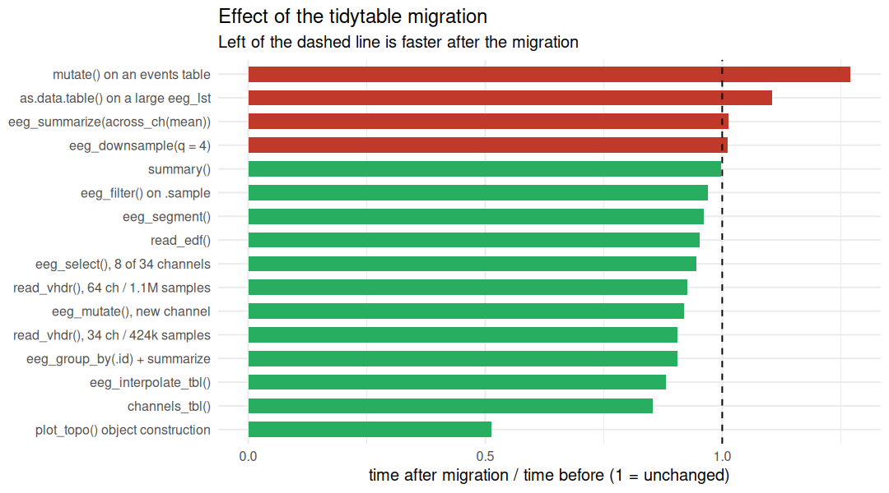
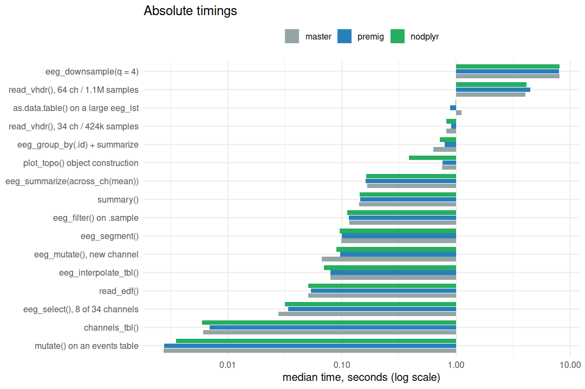

Did the tidytable migration cost anything?
================

- [What this measures](#what-this-measures)
- [The data](#the-data)
- [The cases](#the-cases)
- [Headline](#headline)
- [The verdict](#the-verdict)
- [Checking the two notable cases
  properly](#checking-the-two-notable-cases-properly)
- [Every case, in seconds](#every-case-in-seconds)
- [Memory](#memory)
- [Cases that did not run](#cases-that-did-not-run)
- [How to reproduce](#how-to-reproduce)

## What this measures

Stage 1 of the tidytable migration replaced all 111 internal `dplyr::`
calls in `R/` with tidytable, and rerouted the calls acting on an
`eeg_lst` through eeguana’s own `eeg_*` generics. The question here is
whether that made anything slower.

Three versions are compared, each installed into its own library and
benchmarked in its own R session, since two versions of a package cannot
be loaded at once:

| version   | commit       | what it is                                    |
|-----------|--------------|-----------------------------------------------|
| `master`  | `d140fea`    | what is on GitHub master, eeguana 0.1.11.9001 |
| `premig`  | `942cc0b`    | the commit immediately before the migration   |
| `nodplyr` | working tree | after the migration                           |

**`premig` is the control that answers the question.** It differs from
`nodplyr` only by the migration. `master` is 21 commits behind and
carries 636 other changed lines in `R/`, so a `master` to `nodplyr`
difference mixes the migration together with everything else that landed
in between. It is included because it is what users actually have.

## The data

Benchmarks run against the real fixture recordings rather than synthetic
data:

| file           | channels | samples   | in memory |
|----------------|----------|-----------|-----------|
| `s04.eeg`      | 64       | 1,115,420 | 553 Mb    |
| `s1_faces.eeg` | 34       | 424,488   | 113 Mb    |

64 channels matters: that is the range where the
`data.table::setcolorder()` problem lived, so `eeg_summarize()` carries
a guard there.

## The cases

Each case is here because its code was migrated, or because it leans on
data.table and so is a baseline for the next stage of work.

| Case                | Group     | What                               | Why it is here                                                            | Iterations |
|:--------------------|:----------|:-----------------------------------|:--------------------------------------------------------------------------|-----------:|
| read_vhdr_64ch      | Reading   | read_vhdr(), 64 ch / 1.1M samples  | read.R migrated; check_dat_size() added; 553 Mb result                    |          5 |
| read_vhdr_34ch      | Reading   | read_vhdr(), 34 ch / 424k samples  | same path, smaller object                                                 |          7 |
| read_edf            | Reading   | read_edf()                         | read.R migrated (dplyr::case_when, dplyr::tibble)                         |         10 |
| eeg_select          | Verbs     | eeg_select(), 8 of 34 channels     | dplyr_verbs.R; select on a large signal table                             |         20 |
| eeg_filter          | Verbs     | eeg_filter() on .sample            | dplyr_verbs.R and dplyr_ext.R; semi_join on .segments was migrated        |         20 |
| eeg_mutate          | Verbs     | eeg_mutate(), new channel          | dplyr_verbs.R; writes a column into a large signal table                  |         20 |
| eeg_summarize_ch    | Verbs     | eeg_summarize(across_ch(mean))     | eeg_summarize() carries the setcolorder guard; across_ch over 34 channels |         10 |
| eeg_group_summarize | Verbs     | eeg_group_by(.id) + summarize      | grouping path; eeg_group_vars() is now called directly                    |         10 |
| eeg_segment         | Transform | eeg_segment()                      | segmentation.R migrated; heavy data.table joins                           |         10 |
| eeg_downsample      | Transform | eeg_downsample(q = 4)              | signal_processing.R; data.table heavy, next to be migrated                |         10 |
| as_data_table       | Output    | as.data.table() on a large eeg_lst | to_tbl.R migrated; long-format conversion of 424k x 34                    |         10 |
| summary_eeg_lst     | Output    | summary()                          | rewritten: group_by_at(vars(-…)) replaced with explicit .by               |         10 |
| channels_tbl        | Output    | channels_tbl()                     | tbl.R; the data.frame assignment method was rewritten in base R           |         30 |
| events_mutate       | Events    | mutate() on an events table        | events_tbl.R migrated; as_events_tbl() now restores attributes            |         30 |
| interpolate_tbl     | Plotting  | eeg_interpolate_tbl()              | rewritten: persistent grouping replaced with explicit .by                 |         10 |
| plot_topo           | Plotting  | plot_topo() object construction    | plot.R migrated; plot_topo.tbl_df widened to .data.frame                  |         10 |

## Headline

Against the pre-migration commit, the median ratio across 16 cases is
**0.949** (1.000 would be identical). The slowest case is **1.27x** and
the fastest is **0.51x**. Anything within roughly 0.95–1.05 is noise on
a machine that is doing other things.

<!-- -->

## The verdict

**The migration cost nothing.** Against `premig`, which differs only by
the migration, nothing got slower and memory allocation is unchanged.
The heavy cases are flat: reading 64 channels x 1.1M samples, and
`eeg_downsample()`.

**`plot_topo()` got about twice as fast**, confirmed separately at 60
iterations: 0.813 s to 0.424 s. Rewriting `eeg_interpolate_tbl()` to
carry its grouping as a character vector rather than as state on the
object removed real work, not just dplyr.

**There is a slowdown against master, and the migration did not cause
it.** Three verbs are slower than `master`, and in each one `premig` is
already slower while `nodplyr` is slightly faster than `premig`. The
cost came from the 21 commits in between:

| Case                           | master (s) | premig (s) | nodplyr (s) | vs master | vs premig |
|:-------------------------------|-----------:|-----------:|------------:|----------:|----------:|
| eeg_select(), 8 of 34 channels |     0.0276 |     0.0336 |      0.0318 |     1.150 |     0.945 |
| eeg_mutate(), new channel      |     0.0667 |     0.0967 |      0.0889 |     1.333 |     0.919 |
| eeg_group_by(.id) + summarize  |     0.6334 |     0.7931 |      0.7181 |     1.134 |     0.905 |

The memory figures point the same way: `eeg_mutate()` allocates 240.8 Mb
on master against 357.4 Mb on both `premig` and `nodplyr`, and
`eeg_select()` 59.5 Mb against 88.7 Mb. Whatever changed, it changed
before the migration and is worth its own investigation.

## Checking the two notable cases properly

At the iteration counts used above, a sub-millisecond case cannot be
measured reliably. `mutate()` on an events table looked 1.27x slower, so
both notable cases were re-measured at many more iterations:

| id            | iterations |  master |  premig | nodplyr | nodplyr/premig |
|:--------------|-----------:|--------:|--------:|--------:|---------------:|
| events_mutate |        300 | 0.00331 | 0.00284 | 0.00291 |          1.023 |
| plot_topo     |         60 | 0.80394 | 0.81324 | 0.42414 |          0.522 |

`mutate()` on an events table comes out at **1.02x**, inside an IQR of
0.0006 s. `plot_topo()` holds at **0.52x**.

Running the events case twice per version, interleaved, at 2000
iterations shows why the original number could not be trusted:

| run    | premig    | nodplyr   |
|--------|-----------|-----------|
| first  | 0.00259 s | 0.00365 s |
| second | 0.00342 s | 0.00341 s |

`premig` differs from *itself* by 1.32x between its own two runs, which
is larger than the difference being claimed, and the second pair is
identical.

The mechanism rules it out as well. The only code the migration added to
that path is `keep_dt_attrs()`, and measured directly it takes **3.4
microseconds**, **0.127%** of the 2.6 ms call. It cannot produce a 30%
change.

**The lesson for reading the table below: ignore any ratio on a case
whose absolute time is a few milliseconds.** Those rows are marked.

## Every case, in seconds

Rows marked `*` run in under 10 ms. Their ratios are dominated by
machine noise, so read the absolute numbers and ignore the ratio.

| Group     | Case                               | master (s) | premig (s) | nodplyr (s) | vs premig | vs master |
|:----------|:-----------------------------------|-----------:|-----------:|------------:|----------:|----------:|
| Events    | mutate() on an events table \*     |    0.00273 |    0.00277 |     0.00352 |     1.271 |     1.292 |
| Output    | as.data.table() on a large eeg_lst |    1.11000 |    0.89100 |     0.98600 |     1.106 |     0.885 |
| Output    | channels_tbl() \*                  |    0.00611 |    0.00694 |     0.00592 |     0.853 |     0.969 |
| Output    | summary()                          |    0.14100 |    0.14400 |     0.14400 |     0.998 |     1.019 |
| Plotting  | eeg_interpolate_tbl()              |    0.07940 |    0.07890 |     0.06960 |     0.882 |     0.876 |
| Plotting  | plot_topo() object construction    |    0.75600 |    0.75700 |     0.38800 |     0.513 |     0.513 |
| Reading   | read_edf()                         |    0.05090 |    0.05330 |     0.05080 |     0.953 |     0.999 |
| Reading   | read_vhdr(), 34 ch / 424k samples  |    0.81700 |    0.91100 |     0.82500 |     0.906 |     1.009 |
| Reading   | read_vhdr(), 64 ch / 1.1M samples  |    4.07000 |    4.49000 |     4.16000 |     0.927 |     1.022 |
| Transform | eeg_downsample(q = 4)              |    8.10000 |    7.98000 |     8.07000 |     1.011 |     0.997 |
| Transform | eeg_segment()                      |    0.09900 |    0.09980 |     0.09590 |     0.961 |     0.969 |
| Verbs     | eeg_filter() on .sample            |    0.11600 |    0.11500 |     0.11200 |     0.969 |     0.961 |
| Verbs     | eeg_group_by(.id) + summarize      |    0.63300 |    0.79300 |     0.71800 |     0.905 |     1.134 |
| Verbs     | eeg_mutate(), new channel          |    0.06670 |    0.09670 |     0.08890 |     0.919 |     1.333 |
| Verbs     | eeg_select(), 8 of 34 channels     |    0.02760 |    0.03360 |     0.03180 |     0.945 |     1.150 |
| Verbs     | eeg_summarize(across_ch(mean))     |    0.16700 |    0.16100 |     0.16300 |     1.014 |     0.976 |

<!-- -->

## Memory

tidytable verbs copy where dplyr did, so allocation is worth watching as
well as time.

| Case                               | master    | premig    | nodplyr   | vs premig |
|:-----------------------------------|:----------|:----------|:----------|----------:|
| read_vhdr(), 64 ch / 1.1M samples  | 4535.4 Mb | 4535.4 Mb | 4534.4 Mb |     1.000 |
| read_vhdr(), 34 ch / 424k samples  | 1110.6 Mb | 1110.6 Mb | 1110.9 Mb |     1.000 |
| read_edf()                         | 30.1 Mb   | 30.2 Mb   | 29.8 Mb   |     0.987 |
| eeg_select(), 8 of 34 channels     | 59.5 Mb   | 88.7 Mb   | 88.7 Mb   |     1.000 |
| eeg_filter() on .sample            | 355.9 Mb  | 355.9 Mb  | 355.8 Mb  |     1.000 |
| eeg_mutate(), new channel          | 240.8 Mb  | 357.4 Mb  | 357.4 Mb  |     1.000 |
| eeg_summarize(across_ch(mean))     | 331.1 Mb  | 331.2 Mb  | 331.3 Mb  |     1.000 |
| eeg_group_by(.id) + summarize      | 599.2 Mb  | 599.3 Mb  | 599.3 Mb  |     1.000 |
| eeg_segment()                      | 51.1 Mb   | 51.1 Mb   | 51 Mb     |     0.999 |
| eeg_downsample(q = 4)              | 3236 Mb   | 3264.4 Mb | 3264.4 Mb |     1.000 |
| as.data.table() on a large eeg_lst | 1376.9 Mb | 1376.9 Mb | 1376.9 Mb |     1.000 |
| summary()                          | 392.1 Mb  | 392.1 Mb  | 390.9 Mb  |     0.997 |
| channels_tbl()                     | 0.3 Mb    | 0.3 Mb    | 0.4 Mb    |     1.456 |
| mutate() on an events table        | 0.2 Mb    | 0.2 Mb    | 0.2 Mb    |     0.834 |
| eeg_interpolate_tbl()              | 7.5 Mb    | 7.5 Mb    | 6 Mb      |     0.801 |
| plot_topo() object construction    | NA        | NA        | NA        |        NA |

## Cases that did not run

A case can fail on a version because the function was broken there,
which is itself a result.

Every case ran on every version.

## How to reproduce

Each version is installed into its own library, because two versions of
one package cannot be loaded in a single session:

``` sh
# one worktree and one library per version
git worktree add --detach $BENCH_DIR/src_master  d140fea
git worktree add --detach $BENCH_DIR/src_premig  942cc0b
R CMD INSTALL -l $BENCH_DIR/libs/master  $BENCH_DIR/src_master
R CMD INSTALL -l $BENCH_DIR/libs/premig  $BENCH_DIR/src_premig
R CMD INSTALL -l $BENCH_DIR/libs/nodplyr .          # the working tree

cd dev/benchmarks
BENCH_DIR=... ./run_all.sh        # all three, in sequence, never overlapping
Rscript verify_outliers.R nodplyr $BENCH_DIR/libs/nodplyr results/verify.csv
Rscript -e 'rmarkdown::render("benchmarks.Rmd")'
```

`run_all.sh` runs the versions one at a time on purpose. Two R sessions
competing for CPU would make every number meaningless.

Run on 2026-09-13 with eeguana versions: master 0.1.11.9001, premig
0.1.12.9003, nodplyr 0.1.12.9003
